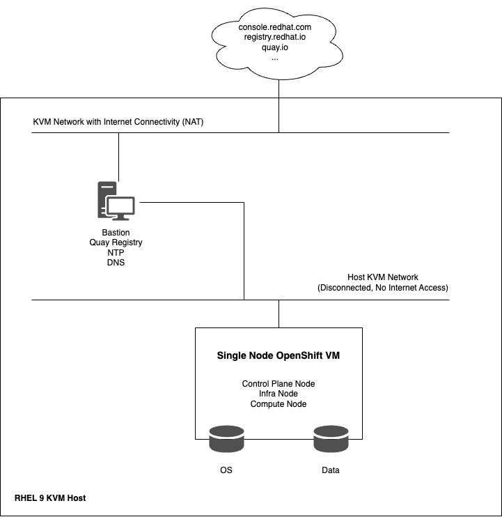
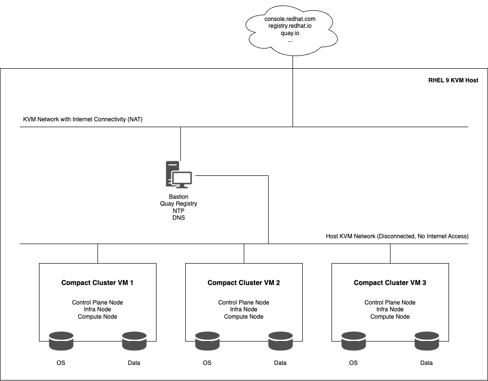

## Architecture Layout on KVM Host

- Single Node OpenShift on KVM Host Setup:


\
&nbsp;
- Compact Cluster on KVM Host Setup:



## Setting up the Bastion VM

- Bastion VM will have 2 vNICs, connected to 2 different networks on the KVM Host
    - One of the networks will need to have internet access (via NAT) and the one will be used as host-only network (fully disconnected from the Internet)
- Proceed to install the latest RHEL 9 on the VM (minimal install)
    - The VM should have at least 500GB of free space
    - Make sure to assign all the available space to `/`
- Run the following commands to install the required packages in the bastion VM
```
$ subscription-manager register
$ dnf update -y
$ dnf install install vim net-tools git wget podman nmstate -y
$ systemctl start podman
$ systemctl enable podman
```

- Go to the following [link](https://console.redhat.com/openshift/downloads) and download all the required packages, i.e. `mirror-registry-amd64.tar.gz`, `oc-mirror.rhel9.tar.gz`, `openshift-client-linux.tar.gz`, `openshift-install-linux.tar.gz`


## DNS Configurations on the Bastion VM (Optional)

- Follow the following [documentation](https://docs.redhat.com/en/documentation/red_hat_enterprise_linux/9/html/managing_networking_infrastructure_services/assembly_setting-up-and-configuring-a-bind-dns-server_networking-infrastructure-services#proc_configuring-bind-as-a-caching-dns-server_assembly_setting-up-and-configuring-a-bind-dns-server) if an external DNS server is not available
- Install the packages required to set up the DNS server
```
dnf install bind bind-utils -y
```

- Update `/etc/named.conf`
- A sample configuration for a server with IP address `192.168.100.100` on the disconnected network and `192.168.122.100` on the network with internet connectivity will look like the following
```
//
// named.conf
//
// Provided by Red Hat bind package to configure the ISC BIND named(8) DNS
// server as a caching only nameserver (as a localhost DNS resolver only).
//
// See /usr/share/doc/bind*/sample/ for example named configuration files.
//

options {
        listen-on port 53 { 127.0.0.1; 192.168.122.100; 192.168.100.100;};
	listen-on-v6 port 53 { ::1; };
	directory 	"/var/named";
	dump-file 	"/var/named/data/cache_dump.db";
	statistics-file "/var/named/data/named_stats.txt";
	memstatistics-file "/var/named/data/named_mem_stats.txt";
	secroots-file	"/var/named/data/named.secroots";
	recursing-file	"/var/named/data/named.recursing";
        allow-query     { localhost; 192.168.100.0/24; 192.168.122.0/24; 0.0.0.0/0;};
        allow-recursion { localhost; 192.168.100.0/24; 192.168.122.0/24; };

	/* 
	 - If you are building an AUTHORITATIVE DNS server, do NOT enable recursion.
	 - If you are building a RECURSIVE (caching) DNS server, you need to enable 
	   recursion. 
	 - If your recursive DNS server has a public IP address, you MUST enable access 
	   control to limit queries to your legitimate users. Failing to do so will
	   cause your server to become part of large scale DNS amplification 
	   attacks. Implementing BCP38 within your network would greatly
	   reduce such attack surface 
	*/
	recursion yes;

	dnssec-validation yes;

	managed-keys-directory "/var/named/dynamic";
	geoip-directory "/usr/share/GeoIP";

	pid-file "/run/named/named.pid";
	session-keyfile "/run/named/session.key";

	/* https://fedoraproject.org/wiki/Changes/CryptoPolicy */
	include "/etc/crypto-policies/back-ends/bind.config";
};

logging {
        channel default_debug {
                file "data/named.run";
                severity dynamic;
        };
};

zone "." IN {
	type hint;
	file "named.ca";
};

zone "eanylin.com" {
    type master;
    file "eanylin.com.zone";
    allow-query { any; };
    allow-transfer { none; };
};

zone "100.168.192.in-addr.arpa" {
    type master;
    file "100.168.192.in-addr.arpa.zone";
    allow-query { any; };
    allow-transfer { none; };
};

include "/etc/named.rfc1912.zones";
include "/etc/named.root.key";
```

- Create the zone files in the `/var/named/` directory
```
$ cat eanylin.com.zone
$TTL 8h
@ IN SOA bastion.eanylin.com. root.eanylin.com. (
                          2022070601 ; serial number
                          1d         ; refresh period
                          3h         ; retry period
                          3d         ; expire time
                          3h )       ; minimum TTL

                      IN NS   bastion.eanylin.com.

bastion                IN A    192.168.100.50
api.hub               IN A    192.168.100.20
*.apps.hub            IN A    192.168.100.21
master-0.hub          IN A    192.168.100.22
master-1.hub          IN A    192.168.100.23
master-2.hub          IN A    192.168.100.24
```

```
$ cat 100.168.192.in-addr.arpa.zone
TTL 8h
@ IN SOA bastion.eanylin.com. root.eanylin.com. (
                          2022070601 ; serial number
                          1d         ; refresh period
                          3h         ; retry period
                          3d         ; expire time
                          3h )       ; minimum TTL

                        IN NS   bastion.eanylin.com.

50                      IN PTR  bastion.eanylin.com.
20                      IN PTR  api.hub.eanylin.com.
22                      IN PTR  master-0.hub.eanylin.com.
23                      IN PTR  master-1.hub.eanylin.com.
24                      IN PTR  master-2.hub.eanylin.com.
$
```

- Verify the syntax of the `/etc/named.conf` file and check the configuration of the zones
```
$ named-checkconf
$ named-checkzone 100.168.192.in-addr.arpa 100.168.192.in-addr.arpa.zone
$ named-checkzone eanylin.com eanylin.com.zone
```

- Add firewall rules for DNS and start and enable `named` service
```
$ firewall-cmd --permanent --add-service=dns
$ firewall-cmd --reload
$ systemctl enable --now named
$ systemctl status named
```

- Check that DNS resolves properly


## NTP Configurations on the Bastion VM (Optional)
- Follow instructions in the [documentation](https://www.redhat.com/en/blog/chrony-time-services-linux) to configure Chrony NTP services if an external NTP server is not available


## Set up Mirror Registry and perform the required mirroring on the Bastion VM

- Go to the following [link](https://console.redhat.com/openshift/downloads#tool-mirror-registry) and download the latest version of the mirror registry 
- Install the mirror registry for Red Hat OpenShift
```
$ ./mirror-registry install --quayHostname bastion.eanylin.com --quayRoot /root/quay
```

- Use the user name and password generated during the installation to log into the registry by running the following command:
```
$ podman login -u init -p <password> https://bastion.eanylin.com:8443 --tls-verify=false
```
 
- Take care of the self-signed certs of the Bastion VM
```
$ cd /root/quay/
$ ls
quay-config  quay-rootCA
$ cp rootCA.pem /etc/pki/ca-trust/source/anchors/
$ update-ca-trust extract
```

- Download Pull Secrets from this [link](https://console.redhat.com/openshift/install/pull-secret)
- Make a copy of the pull secret in JSON format by running the following command:
```
$ cat ./pull-secret | jq . > pull-secret.json
```

- If the `$XDG_RUNTIME_DIR/containers` directory does not exist, create one by entering the following command:
```
mkdir -p $XDG_RUNTIME_DIR/containers
```

- Create and/or append the `auth.json` file with the required credentials
- Perform Mirroring
```
$ oc mirror --config=./image-set-configuration-4.18.7.yaml docker://bastion.eanylin.com:8443/ocp4
```


## Install OpenShift Cluster
- Follow instructions in the OpenShift 4.18 [documentation](https://docs.redhat.com/en/documentation/openshift_container_platform/4.18/html-single/installing_an_on-premise_cluster_with_the_agent-based_installer/index#prerequisites_installing-with-agent-based-installer) to deploy the cluster
- Create `install-config.yaml` and `agent-config.yaml` files
- Generate ISO and use it to boot the servers
- Check installation progress after that
```
$ ./openshift-install version
$ ./openshift-install --dir /root/hub agent create image
$ ./openshift-install -dir /root/hub agent wait-for bootstrap-complete --log-level=debug
$ ./openshift-install --dir /root/hub agent wait-for install-complete --log-level=debug
```


## Post Installation - Create CatalogSource, ImageContentSourcePolicy
- Disable the default OperatorHub catalog sources
```
$ oc patch OperatorHub cluster --type json -p '[{"op": "add", "path": "/spec/disableAllDefaultSources", "value": true}]'
```

- Create a CatalogSource in the cluster
```
$ oc create -f oc-mirror-workspace/results-xxxxxxxxxxx/catalogSource-cs-redhat-marketplace-index.yaml
``` 

- Create an ImageContentSourcePolicy in the cluster
```
$ oc create -f oc-mirror-workspace/results-xxxxxxxxxxx/imageContentSourcePolicy.yaml
```


## Update `/etc/hosts` on the KVM Host, if needed
```
192.168.100.21  api.hub.eanylin.com
192.168.100.21  oauth-openshift.apps.hub.eanylin.com
192.168.100.21  console-openshift-console.apps.hub.eanylin.com
192.168.100.21  grafana-openshift-monitoring.apps.hub.eanylin.com
192.168.100.21  thanos-querier-openshift-monitoring.apps.hub.eanylin.com
192.168.100.21  prometheus-k8s-openshift-monitoring.apps.hub.eanylin.com
192.168.100.21  alertmanager-main-openshift-monitoring.apps.hub.eanylin.com
```
